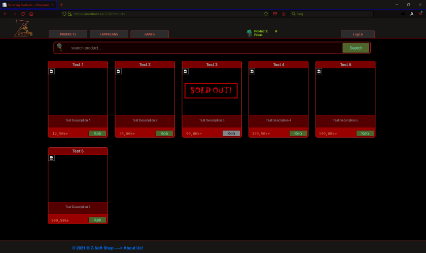
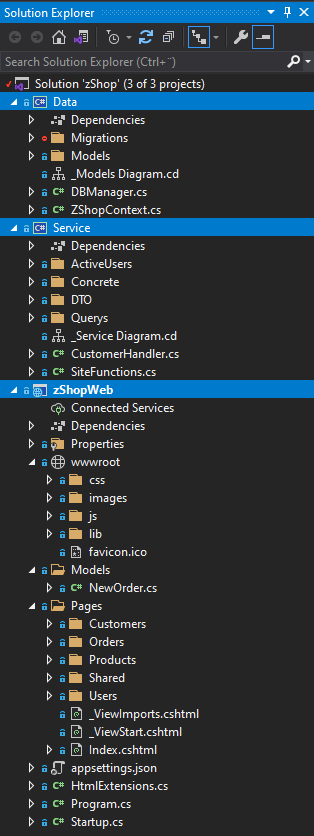
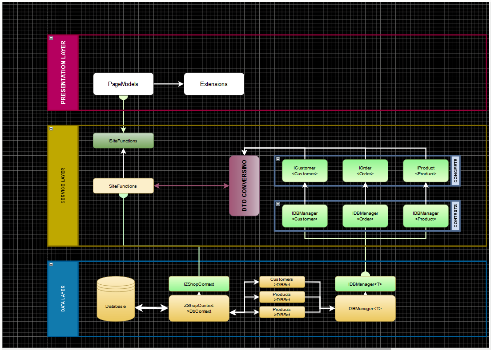

# Z-Soft Games Shop

Check Out : [Docs]() | [Images]() | [Diagrams]()

---

## Table of Contents

- [Description](#description)
    - [Why this repository?](#why-this-repository)
    - [H3 School Webshop Project](#h3-school-webshop-project)
- [Best Practices](#best-practices)
- [Front-Page (UI / Presentation)](#front-page)
    - [Index](#index)
    - [Products](#products)
    - [Orders](#orders)
    - [Customers](#customers)
    - [Cart](#cart)
- [Service Layer](#service)
    - [ISiteFunctions](#sitefunctions)
    - [Concrete Contexts](#concrete-contexts)
    - [DTO Conversion](#dto-conversion)
    - [Querys](#querys)
- [Data Layer](#data-layer)
    - [IZShopContext](#dbcontext)
    - [IDBManager](#dbmanager)
    - [Models](#models)
[Road Map](#road-map)
[Structure](#structure)
[License](#license)
[Credits](#credits)
[Thanks](#thanks)

## Description

Assignment: Webshop 
As part of our education, we are now instructed to create a Webshop which is another building-block ontop of already learned.
This project is supposed to display our skills at implementing EF Core together with Razor Webpages.

## Why this repository?

Part of our education teaches us to put it all on Git, to strengthen knowledge on how to properly use Git.

## H3 School Webshop Project

The first weeks of our H3 semester teached us the wonders of EF Core technology, this is now to be implemented together with Razor Pages.
Now we have 3 weeks course in Learning Razor, were we are learning more about Razor Webpage designs and implementations.

The requirements of this project was as simple as: 
Demonstrate that we fullfill DB Programming III 
Build a Webshop, so basicly a webpage with Products, customers who can place orders
and buy products. 
Design and layout is left to our own imaginations.

## Best Practices

Data Layer:
 - EF Code-First Principle 
 - Database Design

## Front-Page

 - [Index]()
 - [Products]()
 - [Orders]()
 - [Customers]()
 - [Cart]()

## Service

I've decided to go with a single method function that will handle all requests coming from the users via the Presentation Layer 
This method will be the only gateway from UI -> DAL and works like this: 

#### SiteFunctions
**ISiteFunctions > SiteFunctions > PerformAction(Action, Function, T)**

where UI is implementing ISiteFunctions through dependency injection (DI), this return an object that depending on request being made
returns a 'fixed' set of data, my believe is that in this was a user cannot get anything else that the current page will deliver.

 - Action **CRUD & Query**
 - Function **Customer / Order / Product**
 - T Data **Data based upon above selection**

Checkout [Diagram]()

#### Concrete Contexts
#### DTO Conversion
#### Querys

## Data Layer

#### DBContext
#### DBManager
#### Models

## Structure

## Road Map

Features implemented so far, or Features planned in the future.

- [x] [DL Structure](https://github.com/ZharaX/zShop/tree/Structure/Layers/Data)
- [x] [DL Models](https://github.com/ZharaX/zShop/tree/Data/Model/Startup)
- [x] [SL Structure](https://github.com/ZharaX/zShop/tree/Service/Startup)
- [x] [UI Structure](https://github.com/ZharaX/zShop/tree/UI/Razor/Core)
- [x] [Feature: Customers](https://github.com/ZharaX/zShop/tree/UI/Feature/Customers)
- [x] [DL Generics](https://github.com/ZharaX/zShop/tree/Data/Changes/GenericDBContextPattern)
- [X] [SL Generics](https://github.com/ZharaX/zShop/tree/Service/GenericRepositoryPattern)
- [ ] [Feature: HighLights]()
- [ ] [Feature: 2]()
- [ ] [Feature: 3]()
- [x] [UI Design: Products]()
- [ ] [UI Design: Orders]()
- [ ] [UI Design: Customers]()
- [x] [UI Account View]()
- [x] [UI Cart View]()
- [x] [UI Login]()

## License

Z-Soft Webshop comes with no Licenses. This is school learning project.

## Credits

zShop is created and maintained by Jens B, and with the help of teachers and classmates.

*Feel free to examine this project and come with feedback by opening some issues.*

## Thanks

To myself :) 
To my teachers for giving their experiences and help me learn more! 
To the fellow students who have some of the same issues, which we then solve together!

[zShop-Version] v0.99-2021-R1